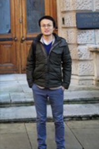
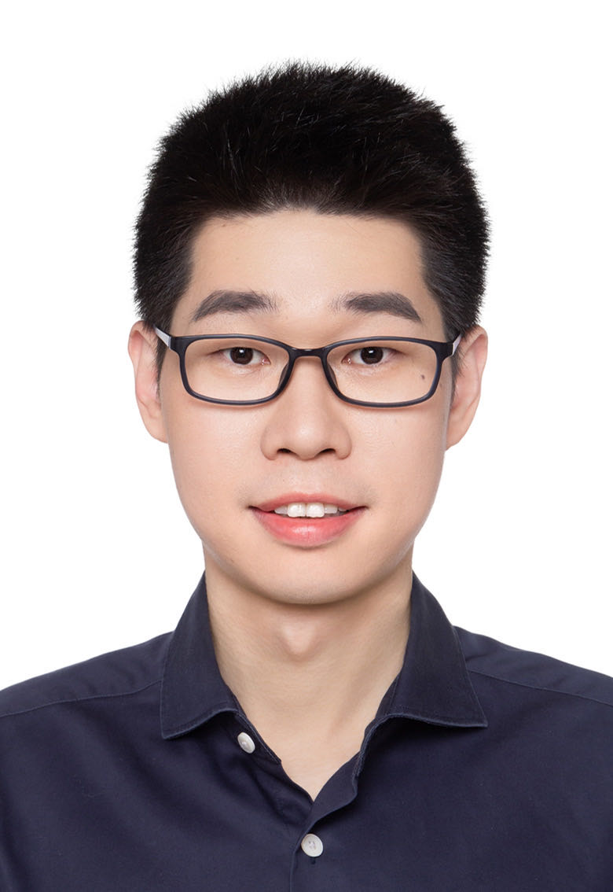
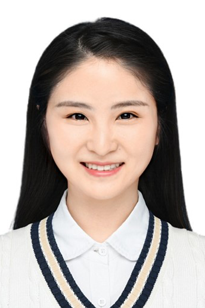
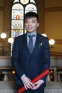
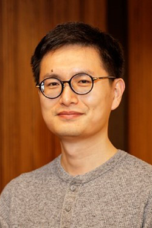
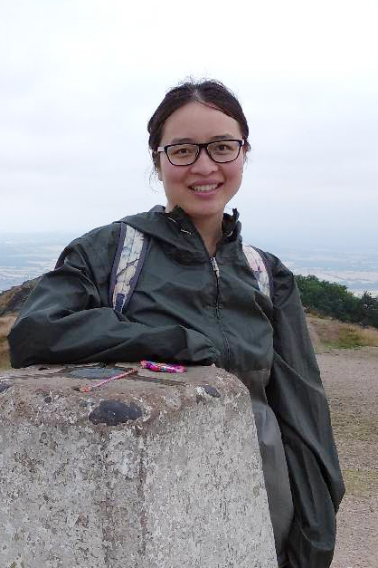
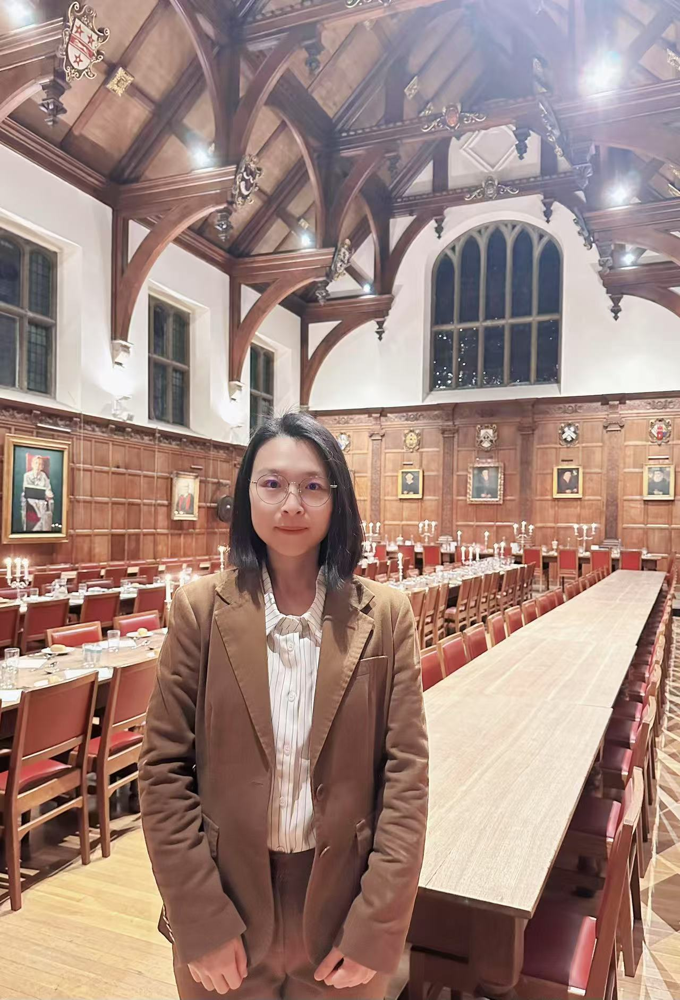
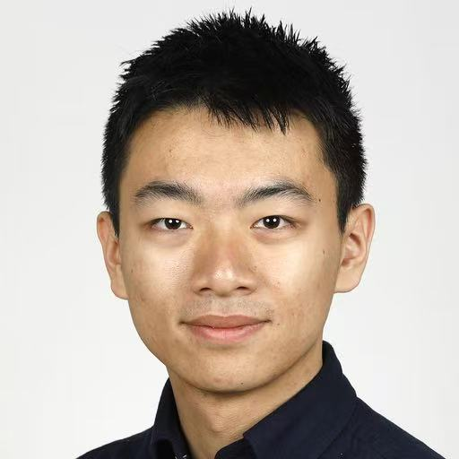
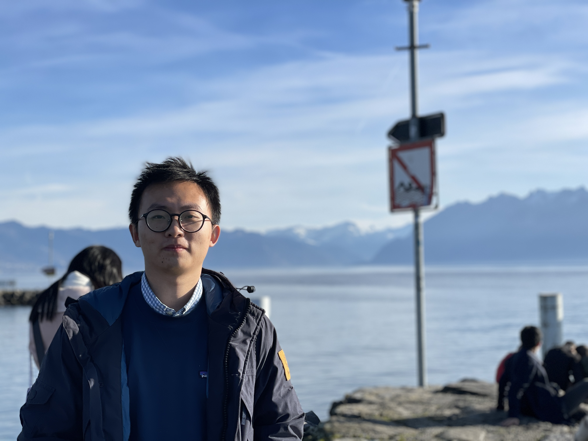


**Chem&Bio** 

Founded in 2022, we are a vibrant and dynamic community that unites passionate scholars, students, and professionals from the fields of Chemistry and Biology. Our mission is to cultivate a collaborative environment where the Chinese community in these disciplines can thrive, exchange knowledge, and contribute to scientific advancements.

**Mission**

To unite and empower the Chinese community in Chemistry and Biology through collaboration and knowledge sharing.

**Meet the Team**

Our team is composed of dedicated individuals who share a passion for Chemistry and Biology.

|2024-2025|                                              |
|----------------|----------------------------------------------|
|

**Zutao Yu** (Honorary Director)

Senior Research Associate, Yusuf Hamied Department of Chemistry, University of Cambridge

|  |
|

**Shenglin Cai** (Director)

Research Associate, Yusuf Hamied Department of Chemistry, University of Cambridge

|  |
|

**Xiaodan Liu** (Director, Finance Minister)

Scientist at RNAvate

|  |
|

**Wenlong Li** (Secretary)

Postdoctoral Research Associate, CRUK Cambridge Institute
|  |
|

**Lin Su** 

Postdoctoral Research Fellow, Yusuf Hamied Department of Chemistry, University of Cambridge

|  |
|

**Tao Yan** 

Researcher, Illumina

|  |
|

**Yuqiong Zhang** (Accountant Associate)

|  |
|

**Ying Liu** 

Research Associate, Yusuf Hamied Department of Chemistry, University of Cambridge

|  |
|

**Liu Shi** 

Associate Director, Nxera pharma

|  |
|

**Jingxiu Xu** 

Postdoctoral Fellow, Department of Biochemistry, Cambridge of University.

|  |
|

**Haowen Zhao** 

PhD student, Yusuf Hamied Department of Chemistry, University of Cambridge.

|  |
|

**Yangteng Ou** 

Ph.D. student under the supervision of Prof. Tuomas Knowles at Yusuf Hamied Department of Chemistry, Cambridge. Main research interests include droplet microfluidics-based biotechnology development, soft material science and engineering, and biophysics.

|  |

**2022-2024**

Zutao Yu, Shenglin Cai, Yuqi Chen, Xiaodan Liu, Wenlong Li, Lin Su, Tao Yan, Yuqiong Zhang.

**Contact Us**

We would love to hear from you! Whether you have questions, suggestions, or would like to get involved, please feel free to reach out to us. 
You can contact us via:

Email: biobridgechem at gmail dot com

Linkedin: www.linkedin.com/in/biobridgechem

We’re here to support you and answer any queries you may have.
