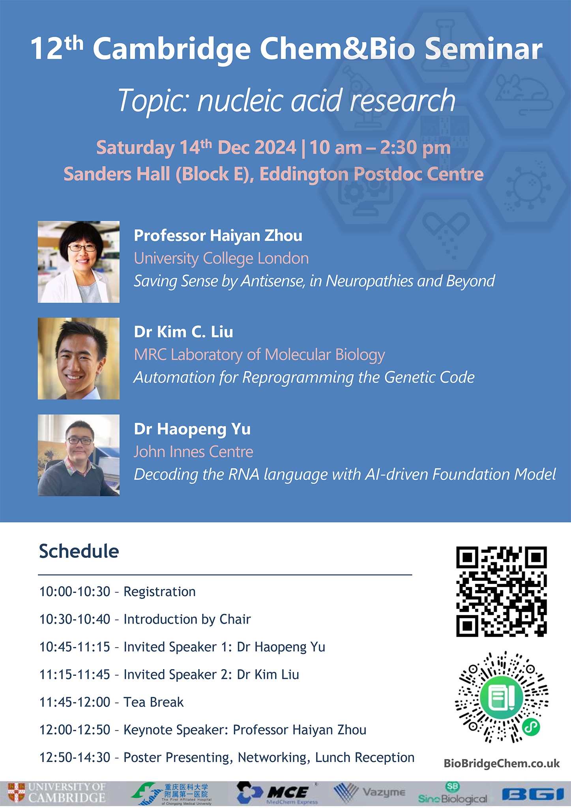

## Speakers and titles

Professor Haiyan Zhou (Keynote Speaker), Saving Sense by Antisense, in Neuropathies and Beyond

Dr Kim C. Liu, Automation for Reprogramming the Genetic Code

Dr Haopeng Yu, Decoding the RNA lanquage with Al-driven Foundation Model
