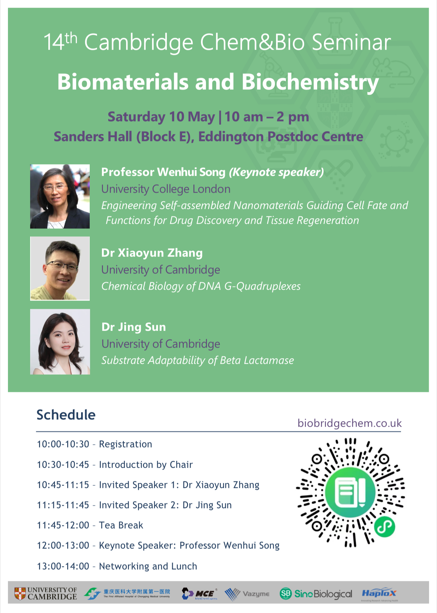

**Speakers and titles**

Professor Wenhui Song (Keynote speaker), University College London, Engineering Self-assembled Nanomaterials Guiding Cell Fate andFunctions for Drug Discovery and Tissue Regeneration

Dr Xiaoyun Zhang, University of Cambridge, Chemical Biology of DNA G-Quadruplexes

Dr Jing sun, University of Cambridge, Substrate Adaptability of Beta Lactamase
