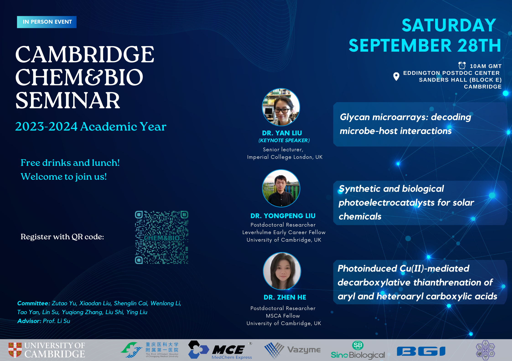

## Speakers and titles

Dr Yan Liu (Keynote Speaker), “Glycan microarrays: decoding microbe-host interactions”

Dr Yongpeng Liu, “Synthetic and biological photoelectrocatalysts for solar chemicals”

Dr Zhen He, “Photoinduced Cu(Il)-mediated decarboxylative thianthrenation of aryl and heteroaryl carboxylic acids”