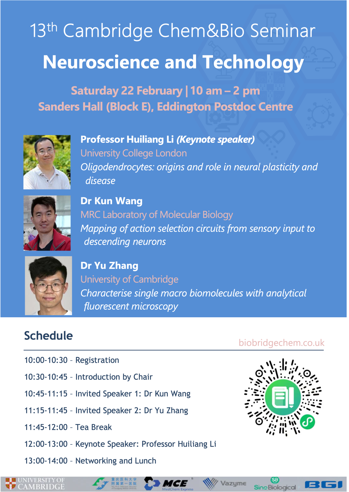

## Speakers and titles

Prof Huiliang Li (Keynote Speaker), Oligodendrocytes: origin and role in neural plasticity and disease

Dr Kun Wang, Mapping of action selection circuits from sensory input to descending neurons

Dr Yu Zhang, Characterise single macro biomolecules with analytical fluorescent microscopy