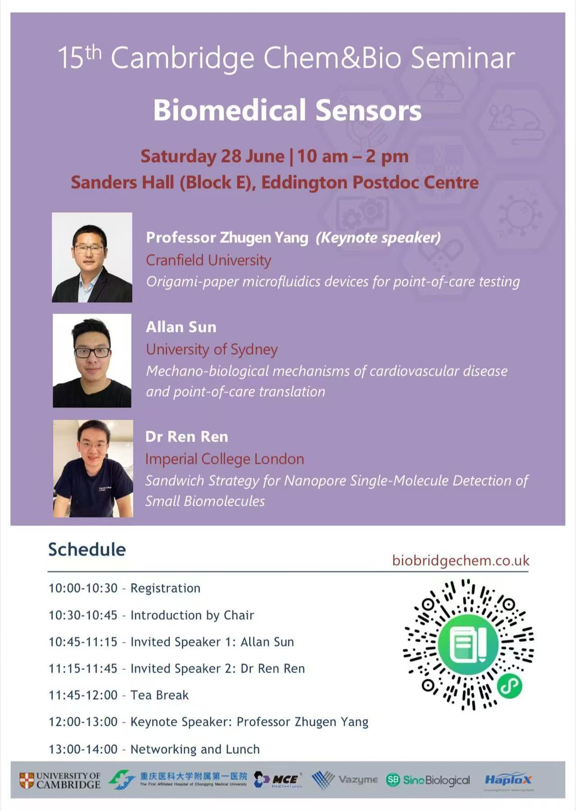

**Speakers and titles**

Professor Zhugen Yang (Keynote speaker), Cranfield University
Origami-paper microfluidics devices for point-of-care testing

Allan Sun, University of Sydney
Mechano-biologicalmechanisms of cardiovascular diseaseand point-of-care translation

Dr Ren Ren, Imperial College London
Sandwich Strategy for Nanopore Single-Molecule Detection ofSmall Biomolecules
