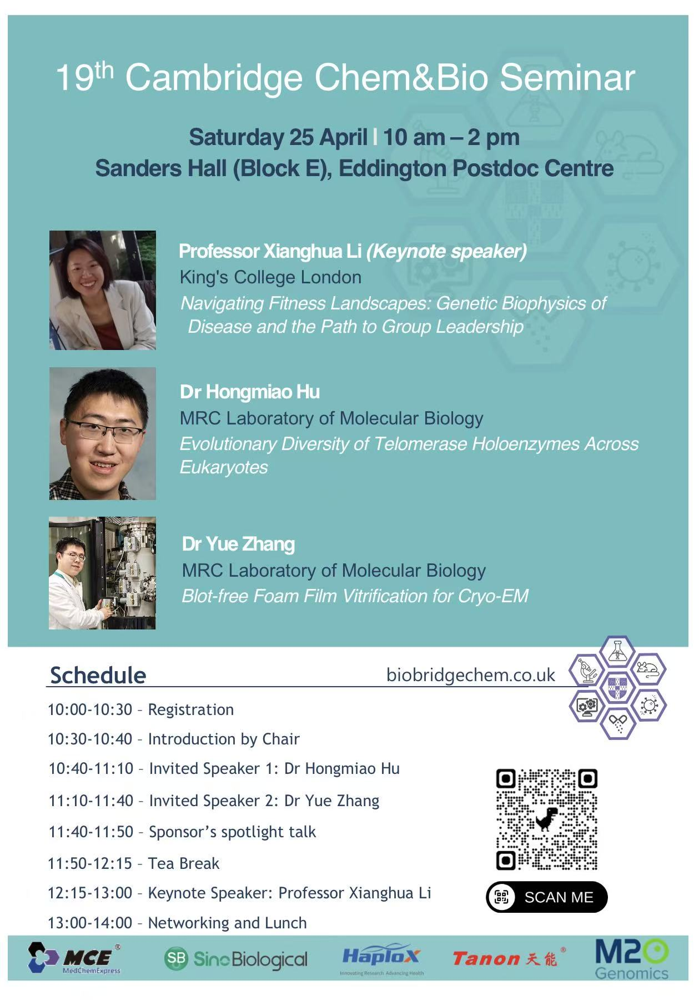

**Time and venue**

Saturday 25 April | 10 am - 2 pm

Sanders Hall (Block E), Eddington Postdoc Centre

**Speakers and titles**

Professor Xianghua Li (Keynote speaker), King's College London

Navigating Fitness Landscapes: Genetic Biophysics of Disease and the Path to Group Leadership

Dr Hongmiao Hu, MRC Laboratory of Molecular Biology

Evolutionary Diversity of Telomerase Holoenzymes Across Eukaryotes

Dr Yue Zhang, MRC Laboratory of Molecular Biology

Blot-free Foam Film Vitrification for Cryo-EM

**Schedule**

10:00-10:30 - Registration

10:30-10:40 - Introduction by Chair

10:40-11:10 - Invited Speaker 1: Dr Hongmiao Hu

11:10-11:40 - Invited Speaker 2: Dr Yue Zhang

11:40-11:50 - Sponsor's spotlight talk

11:50-12:15 - Tea Break

12:15-13:00 - Keynote Speaker: Professor Xianghua Li

13:00-14:00 - Networking and Lunch
