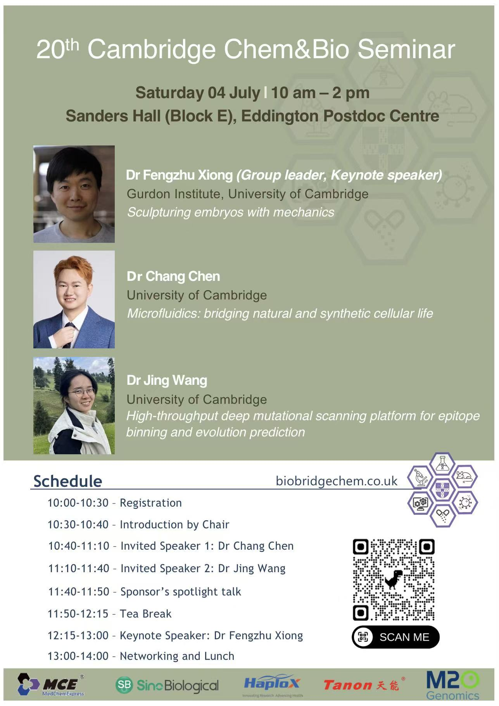

## Time and venue

Saturday 04 July | 10 am - 2 pm

Sanders Hall (Block E), Eddington Postdoc Centre

## Speakers and titles

### Dr Fengzhu Xiong · Keynote speaker

Group leader, Gurdon Institute, University of Cambridge

Sculpting embryos with mechanics

### Dr Chang Chen

University of Cambridge

Microfluidics: bridging natural and synthetic cellular life

### Dr Jing Wang

University of Cambridge

High-throughput deep mutational scanning platform for epitope binning and evolution prediction

## Schedule

| Time | Programme |
| --- | --- |
| 10:00–10:30 | Registration |
| 10:30–10:40 | Introduction by the chair |
| 10:40–11:10 | Invited speaker: Dr Chang Chen |
| 11:10–11:40 | Invited speaker: Dr Jing Wang |
| 11:40–11:50 | Sponsor spotlight talk |
| 11:50–12:15 | Tea break |
| 12:15–13:00 | Keynote speaker: Dr Fengzhu Xiong |
| 13:00–14:00 | Networking and lunch |
