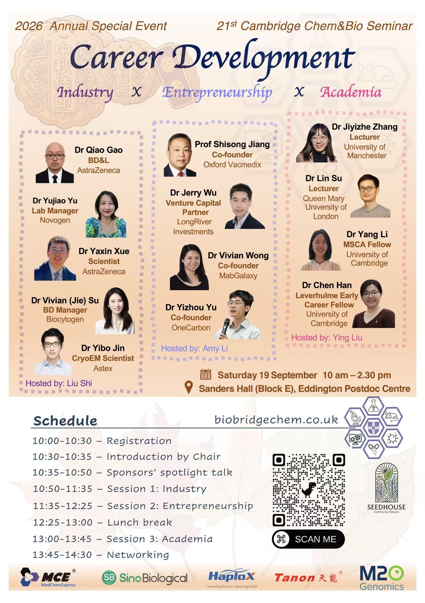

## 2026 Annual Special Event

**Career Development: Industry × Entrepreneurship × Academia**

Three sessions exploring career paths across industry, entrepreneurship and academia, with speakers from research institutions, biotechnology companies and venture capital.

## Time and venue

**Saturday 19 September 2026 · 10:00 am–2:30 pm**

Sanders Hall (Block E), Eddington Postdoc Centre.

## Speakers and sessions

### Session 1 · Industry

**10:50–11:35 · Hosted by Liu Shi**

| Speaker | Role | Organisation |
| --- | --- | --- |
| Dr Qiao Gao | BD&L | AstraZeneca |
| Dr Yujiao Yu | Lab Manager | Novogen |
| Dr Yaxin Xue | Scientist | AstraZeneca |
| Dr Vivian (Jie) Su | BD Manager | Biocytogen |
| Dr Yibo Jin | Cryo-EM Scientist | Astex |

### Session 2 · Entrepreneurship

**11:35–12:25 · Hosted by Amy Li**

| Speaker | Role | Organisation |
| --- | --- | --- |
| Prof Shisong Jiang | Co-founder | Oxford Vacmedix |
| Dr Jerry Wu | Venture Capital Partner | LongRiver Investments |
| Dr Vivian Wong | Co-founder | MabGalaxy |
| Dr Yizhou Yu | Co-founder | OneCarbon |

### Session 3 · Academia

**13:00–13:45 · Hosted by Ying Liu**

| Speaker | Role | Institution |
| --- | --- | --- |
| Dr Jiyizhe Zhang | Lecturer | University of Manchester |
| Dr Lin Su | Lecturer | Queen Mary University of London |
| Dr Yang Li | MSCA Fellow | University of Cambridge |
| Dr Chen Han | Leverhulme Early Career Fellow | University of Cambridge |

## Schedule

| Time | Programme |
| --- | --- |
| 10:00–10:30 | Registration |
| 10:30–10:35 | Introduction by the chair |
| 10:35–10:50 | Sponsors’ spotlight talk |
| 10:50–11:35 | Session 1: Industry |
| 11:35–12:25 | Session 2: Entrepreneurship |
| 12:25–13:00 | Lunch break |
| 13:00–13:45 | Session 3: Academia |
| 13:45–14:30 | Networking |
