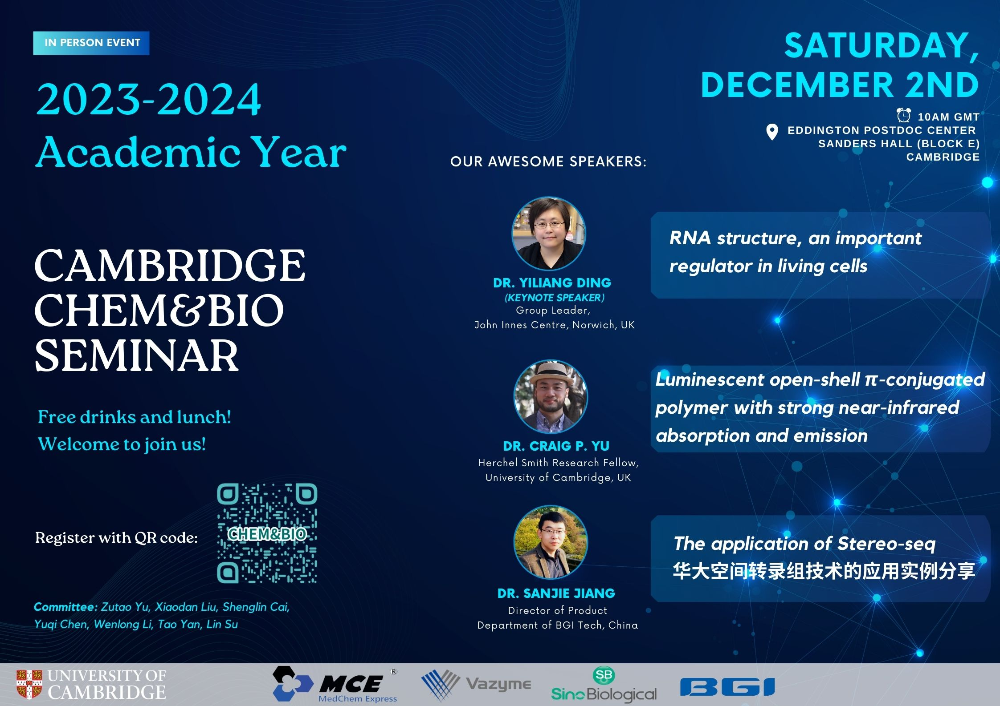

## Speakers and titles

Dr Yiliang Ding (Keynote speaker), “RNA structure, an important regulator in living cells”

Dr Craig P. Yu, “Luminesent open-shell π-conjugated polymer with strong near-infrared absorption and emission”

Dr Sanjie Jiang, “The application of Stereo-seq”
