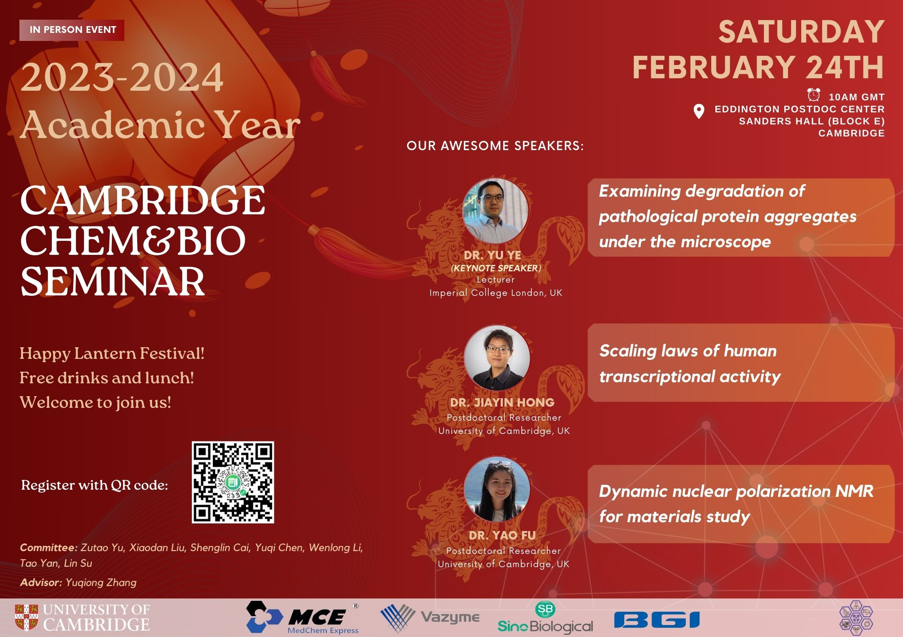

**Speakers and titles**

Dr Yu Ye (Keynote speaker), “Examining degradation of pathological protein aggregates under the microscope”

Dr Jiayin Hong, “Scaling laws of human transcriptional activity”

Dr Yao Fu, “Dynamic nuclear polarization NMR for materials study”
