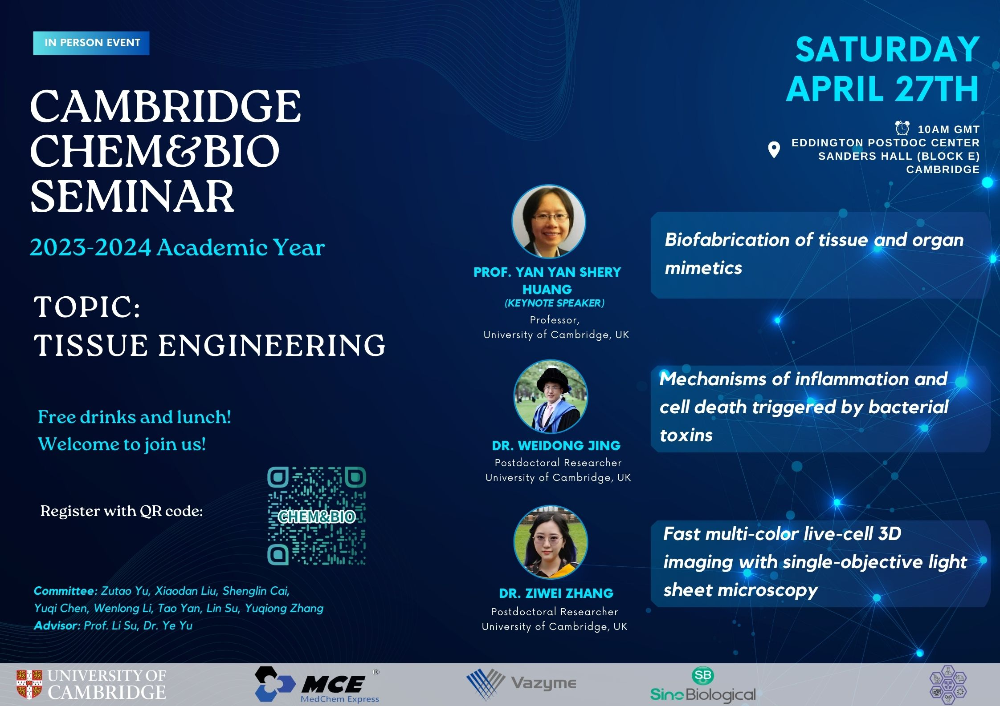

## Speakers and titles

Prof Yan Yan Shery Huang (Keynote speaker), “Biofabrication of tissue and organ mimetics”

Dr Weidong Jing, “Mechanisms of inflammation and cell death triggered by bacterial toxins”

Dr Ziwei Zhang, “Fast multi-color live-cell 3D imaging with single-objective light sheet microscopy”
