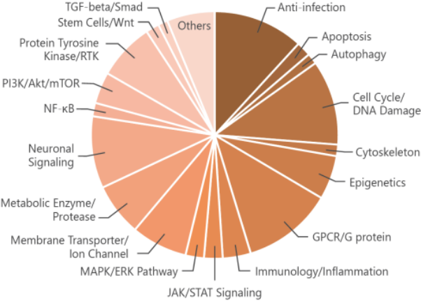
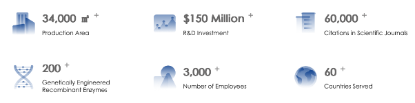

**MCE**

MedChemExpress (MCE) – Master of Bioactive Molecules 

MedChemExpress (MCE) offers a wide range of high-quality research chemicals and biochemicals (novel life-science reagents, reference compounds and natural compounds) for scientific use. They have professionally experienced and friendly staff to meet your needs. Their scientific team is highly experienced and has a successful track record in molecular synthesis. They are proficient in the synthesis of milligram to kilogram scale of structurally diverse and synthetically challenging molecules. They are customer-oriented and work closely with them to meet their need.

*Link:* <https://www.medchemexpress.com/?srsltid=AfmBOoqqPmrHa_d0GL4VaWly0IDahGaAdo_L-KWgs5tjPi4agLkezhe1>

**Vazyme** 

Vazyme is a global technology and service provider that specializes in the design, manufacture, and application of bioactive compounds and continuously expands the application fields of core technologies in life sciences, *in vitro* diagnostics, biomedicine, and exploratory business. To meet the varying needs of their customers and partners, they have developed over 200 types of genetically engineered recombinant enzymes and over 1,000 types of high-performance materials and over 1,000 end products. While remaining steadfast to high quality standards, producing all core materials in-house and adhering to GMP quality control standards, they endeavour to maintain a stable and sufficient supply for global customers by establishing wholly owned branches and localized service teams. Currently, Vazyme has served customers in over 60 countries and regions with wholly owned branches offices in the U.S., Germany, Indonesia, Singapore and Hong Kong SAR. 

*Link:* <https://www.vazymebiotech.com>

**Sino Biological** 

Sino Biological is dedicated to providing the scientific community with high-quality recombinant protein and antibody reagents promoting life science research and drug discovery. 

With the largest validated recombinant protein bank (6500+), Sino Biological offers an extensive selection of antigens including viral proteins, cytokines, growth factors, immune checkpoints, antigens for therapeutic targets, Fc receptors and biomarker proteins. Furthermore, we have independently developed a comprehensive collection of high-quality monoclonal mouse and rabbit antibodies, including neutralizing antibodies and antibody pairs, to support scientific and clinical research.

As the specialist in protein recombinant expression and antibody development, Sino Biological is the one-stop shop for robust customized CRO services. In addition, they have developed several cutting-edge technologies to accelerate pharmaceutical and pre-clinical antibody drug development, featuring VLPs-based membrane protein expression, nanobody production, Beacon-based single cell sorting antibody development, antibody humanization, anti-idiotypic antibody development and AI-powered antibody affinity maturation. 

Sino Biological Europe GmbH is located in Frankfurt with a local sales and service team as well as our comprehensive protein inventory. These facilities enable Sino Biological to deliver high-quality products and services with competitive lead times to our European customers.

*Link:* https://www.sinobiological.com/
